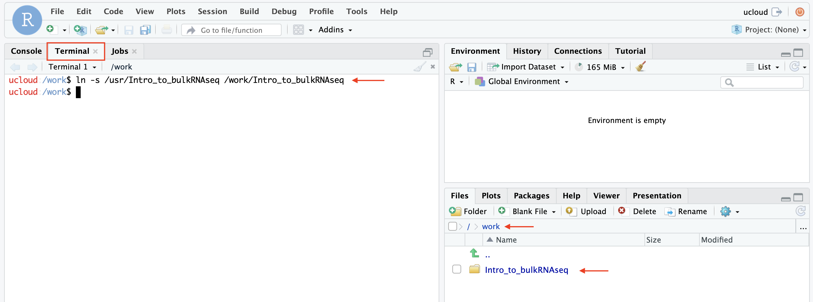

# Transcriptomics sandbox

In this app you will find material for the transcriptomics sandbox of the **[Health Data Science sandbox](https://hds-sandbox.github.io)**. This contains courses you can learn from, datasets and tools you can work with for your own research/learning purposes. Items of this sandbox are currently based on [Rstudio server](https://www.rstudio.com/). Rstudio server is a web-based integrated development environment for R programming language, including Rmarkdowns, code, and data. Usually, each item includes a dedicated webpage with additional informations, guides, and material.

## Available items

Items are periodically added to this app and can be chosen from the menu. Each item can be a course, a setup to work with specific softwares, a research example and comes with all necessary packages installed, eventual notebooks with computer code and explanations, and a dedicated webpage with additional material (notes, slides, recordings, ...).

The available tools are:

| Tool name | Description | Links | Programming language |
| :-----------: | :-----------: | :-----------: | :-----------: |
| **RNAseq in Rstudio**  | <div style="text-align: justify"> Rstudio session with common bulk and single cell RNAseq packages such as DESeq2, Seurat and clusterProfiler. </div> | [Webpage](https://posit.co/) | R, Rstudio |
| **Cirrocumulus**  | <div style="text-align: justify"> Cirrocumulus is an interactive visualization tool for large-scale single-cell genomics data. </div> | [Webpage](https://cirrocumulus.readthedocs.io/en/latest/) | Python, JavaScript |

### Packages installed in *RNAseq in Rstudio*
Additional R packages have been installed in order to work with RNAseq data. Other packages and dependencies might be installed but are not shown here.

| CRAN | Bioconductor | Remotes |
| :-----------: | :-----------:| :-----------: |
| BiocManager   | GenomeInfoDb     | seurat-wrappers |
| tidyverse     | clusterProfiler  | seurat-data     |
| RColorBrewer  | DOSE             | annotables      |
| pheatmap      | org.Hs.eg.db     | seurat-disk     |
| ggrepel       | org.Mm.eg.db     |                 |
| cowplot       | org.Dm.eg.db     |                 |
| Seurat        | pathview         |                 |
| patchwork     | DEGreport        |                 |
| sctransform   | tximport         |                 |
| DESeq2        | AnnotationHub    |                 |
| Signac        | ensembldb        |                 |
|               | apeglm           |                 |
|               | ggnewscale       |                 |
|               | rhdf5            |                 |
|               | slingshot        |                 |
|               | gprofiler2       |                 |

## Courses

The available courses are:

| Course title | Course code | Description | Links | Programming language |
| :-----: | :-----: | :-----: | :-----: | :-----: |
| **Introduction to bulk RNAseq analysis** | Intro_to_bulkRNAseq |<div style="text-align: justify"> A 3-day course to introduce bulk RNAseq analysis, from data alignment to bioinformatics analysis </div> | [Webpage](https://hds-sandbox.github.io/bulk_RNAseq_course/) | R, bash, Nextflow |

### Loading course materials

Materials for courses are available under `/usr/[course_code]`. In order to work with the course materials, please use a *soft link* to link it to the `/work` folder using the **terminal**. For example, in the Rstudio session, I would like to access the "Intro to bulk RNAseq" course material. Enter the following line in the **Terminal** tab of Rstudio:

```{bash}
ln -s /usr/Intro_to_bulkRNAseq /work/Intro_to_bulkRNAseq
```



### Save your work

Everything saved in the `/work` folder will be saved in your personal folder after you finish your job in UCloud. 

**Note** Soft linked folders in `/work` will not be saved. If you want a copy of the materials, copy the material instead using the **Terminal** as before:

```{bash}
cp -r /usr/Intro_to_bulkRNAseq /work/Intro_to_bulkRNAseq
```

## Additional options

Before submitting the app, you can choose the amount of resources you need. Additionally, you can add folders so that they will be visible when using the app. Adding folders is useful if:

- you want to use a folder containing **your own data and code**, with which you want to perform analysis with the Transcriptomics tools of a course/module
- you want to continue working on the material **from a previous session** of the Transcriptomics Sandbox. In such a case, add the folder containing the material using the option `Add folder`. 

