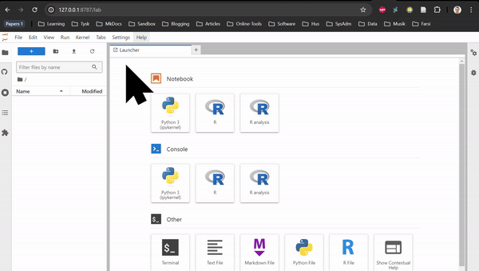
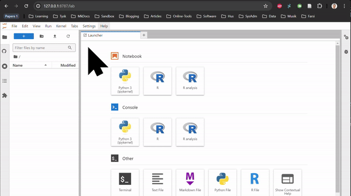
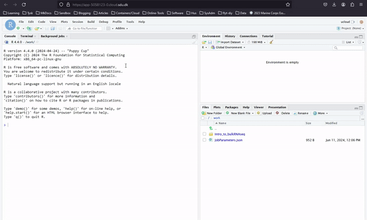
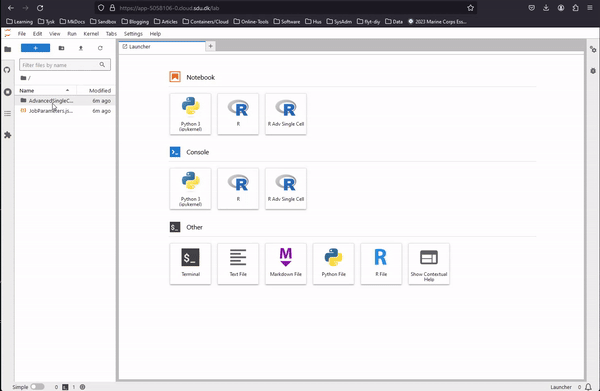
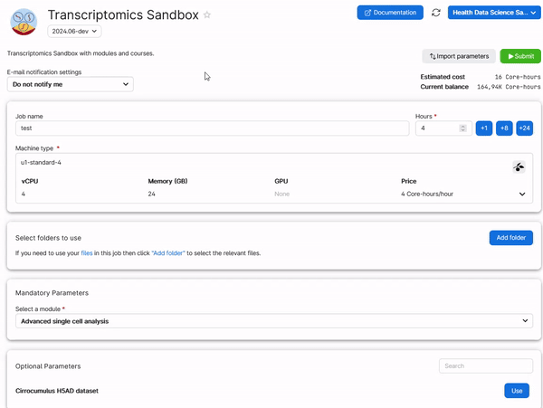

# Transcriptomics sandbox

In this app you will find transcriptomics related courses you can learn from, and datasets and tools you can work with for your own research/learning purposes. The included materials and tools are organized by the **[Danish Health Data Science sandbox](https://hds-sandbox.github.io)**.

The coding modules of this sandbox are currently based on [Rstudio server](https://www.rstudio.com/) and [Jupyterlab](https://jupyter.org/). Rstudio server and Jupyterlab are web-based integrated development environments for (and not limited to) `R`, `python` and `bash` programming languages. They can create interactive coding material (Rmarkdown and Jupyter notebooks) which includes, text, animations, code, and data. 

## Available modules

Learning material and tools are periodically added to this sandbox and can be chosen from the menu. Each module can be a course, a setup to work with specific software, a research example, etc. Each module come with all necessary packages installed, eventual notebooks with computer code and explanations, and a dedicated webpage with additional material (notes, slides, recordings, ...) when this is available.

The available modules are:

| Modules name | Description | Links | Programming language |
| :-----------: | :-----------: | :-----------: | :-----------: |
| **RNAseq in Rstudio**  | 
 Rstudio session with common bulk and single cell RNAseq packages such as DESeq2, Seurat and clusterProfiler. 
 | - | R |
| **Cirrocumulus**  | 
 Cirrocumulus is an interactive visualization tool for large-scale single-cell genomics data. 
 | [Webpage](https://cirrocumulus.readthedocs.io/en/latest/) | - |
| **RNAseq_CLI**  | 
 Jupyter lab session containing common transcriptomics tools (for single cell-RNA and bulk-RNA data analysis), ideal to create your own pipelines (snakemake, nextflow or gwf). It includes all packages from the Rstudio session as well. | - |  Snakemake, R, python (in jupyterLab) |
| **Introduction to bulk RNAseq analysis** |
 A 3-day course to introduce bulk RNAseq analysis, from data alignment to bioinformatics analysis 
 | [Webpage](https://hds-sandbox.github.io/bulk_RNAseq_course/) | R, bash, Nextflow (in Rstudio) |
| **Introduction to single cell RNAseq analysis** |
 A 2-day course to introduce single cell RNAseq analysis in R 
 | [Webpage](https://hds-sandbox.github.io/scRNAseq_course/) | R (in Rstudio) |
| **Advanced single cell analysis** |
 Research-based examples for advanced topics in single cell analysis 
 | [Webpage](https://hds-sandbox.github.io/AdvancedSingleCell/) | R, python, bash (in jupyterLab) |

**Note**: Course materials will be automatically downloaded unless you have "Added a folder" called `Intro_to_bulkRNAseq`, `Intro_to_scRNAseq_R` or `AdvancedSingleCell`, respectively, in the submission step of the transcriptomics app ([see below](#additional-options)).

## How to use the modules

Our modules are designed to be user-friendly and easy to use. Some are for self-learning and come from courses/workshop held in danish universities. Other are tools you can use for your own purpose. Here are some information to get you started:

- **RNAseq in Rstudio** and **RNAseq_CLI** are based on Rstudio server and Jupyterlab, respectively. They do not contain any tutorial, just all the packages used in the tutorials of the transcriptomics sandbox. In Jupyterlab, you can both use the command line in the terminal and the notebooks through the available kernels. See the two animations below for how you start a notebook or a terminal in jupyterlab.

    
    

- **Cirrocumulus** is a tool to visualize single cell RNAseq data. You can explore datasets and visualize them in a user-friendly way. You can also print out gene expression plots, heatmaps and perform differential gene expression for selected cell groups.

- In **Introduction to bulk RNAseq analysis** you can access all the notebooks of an introductory bulk RNA analysis course as below. Here you work with Rstudio. Slides and other materials are available [through the webpage](https://hds-sandbox.github.io/bulk_RNAseq_course/)

    

- In **Introduction to single cell RNAseq analysis** you can access all the notebooks of an introductory single cell RNA analysis course similarly as for the bulk RNA course above. Here you work with Rstudio. Slides and other materials are available [through the webpage](https://hds-sandbox.github.io/scRNAseq_course/)

- In **Advanced single cell analysis** you can run various tutorials and examples of advanced single cell analysis. Here you work with Jupyterlab and Jupyter Notebooks. Slides and other materials are available [through the webpage](https://hds-sandbox.github.io/AdvancedSingleCell/). Look below to see how you access to the notebooks simply through the browser folder.

    

**Tip:** Make a copy of any notebook or R markdown, upload your own data (just use the upload function of Rstudio or JupyterLab), and replicate any analysis you wish on your own data by modifying the code we make available! 

## Where your work is saved

Every time you launch a module, everything is saved in the default folder you are working on. This  will be saved in your user folder after you finish your job in UCloud. The user folder is usually called `Username#Number`. This contains a folder called `Jobs`: here you find all the softwares you executed, and for each execution the saved material which you can retrieve.

## Retrieving your work

To retrieve your work from a previous session of a module, **add a folder** in the submission step of the transcriptomics app which is named `Intro_to_bulkRNAseq`, `Intro_to_scRNAseq_R` or `AdvancedSingleCell`, depending on which module you need to run. See the example below for the `Advanced Single Cell Analysis` module:

**Tip:** only the folders you add in the submission step will be visible when using the app. If you upload data through the uCloud interface, remember to add the folder containing your data if you need to use a module on it.
